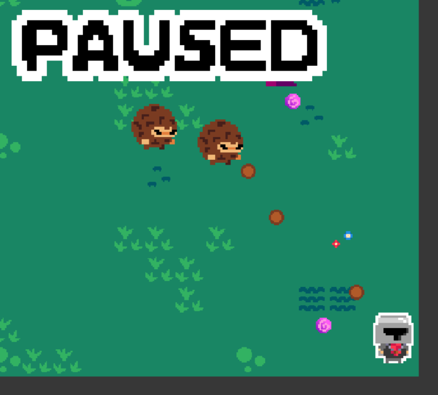

# 1.3 Research

## Soul Knight

<figure><figcaption>
Cover image for the Nintendo Switch version of Soul Knight (<a href="https://www.nintendo.co.uk/Games/Nintendo-Switch-download-software/Soul-Knight-1652172.html">https://www.nintendo.co.uk/Games/Nintendo-Switch-download-software/Soul-Knight-1652172.html</a>)
</figcaption></figure>

### Overview

Soul Knight is a 2D, top-down, rogue-lite made more mobile devices (and Nintendo Switch([https://www.nintendo.co.uk/Games/Nintendo-Switch-download-software/Soul-Knight-1652172.html](https://www.nintendo.co.uk/Games/Nintendo-Switch-download-software/Soul-Knight-1652172.html))) by Chillyroom ([http://www.chillyroom.com/en](http://www.chillyroom.com/en)). The goal of the main game in Soul Knight is to reach the end of the dungeon, using weapons they find on the way, and collect a fragments of the ancient magic stones. It has WAN and LAN multiplayer options.

After the round is over (whether it be by death or reaching the goal) the player will receive some gems to upgrade his character and buy cosmetics which they can use in later runs: hence it being a rogue-lite.

### Controls

As this game is a mobile game (with the exception of the Nintendo Switch release) the game uses touchscreen buttons for the player to interact with as well as a virtual joystick for movement (as seen below).

<figure><figcaption>
Soul Knight gameplay (<a href="https://www.youtube.com/watch?v=IBfVI077M6k&#x26;t=754s">https://www.youtube.com/watch?v=IBfVI077M6k&#x26;t=754s</a>)
</figcaption></figure>

As it is on a mobile device, aiming is difficult using a virtual joystick. Chillyroom's solution to this problem is removing a secondary joystick for aiming weapons and instead replacing it will a single button that fires at the nearest target when pressed.

This UI makes it easy to pick-up and play this game as every major function is a button-press away from being executed.

### Features

In these tabs I will say what I want to include, may include (due to estimated difficulty or not necessary for the first release of the game), and what I don't want to include.



| Feature | Justification |
| ------- | ------------- |
|         |               |
|         |               |
|         |               |



| Feature | Justification |
| ------- | ------------- |
|         |               |
|         |               |
|         |               |





| Feature | Justification |
| ------- | ------------- |
|         |               |
|         |               |
|         |               |



| Feature | Justification |
| ------- | ------------- |
|         |               |
|         |               |
|         |               |



##

## Existing Solution 1 (of 3 or 4)

Images are nice here...

### Overview

Some description of this existing solution

### Aspect 1 (of 2-4 aspects per solution?)

A more detailed description of some aspect of this solution

### Features



| Feature             | Justification                               |
| ------------------- | ------------------------------------------- |
| Feature description | Some reason it's a good fit in this project |



| Feature             | Justification                                              |
| ------------------- | ---------------------------------------------------------- |
| Feature description | Reason it's beyond the scope/not suitable for this project |


