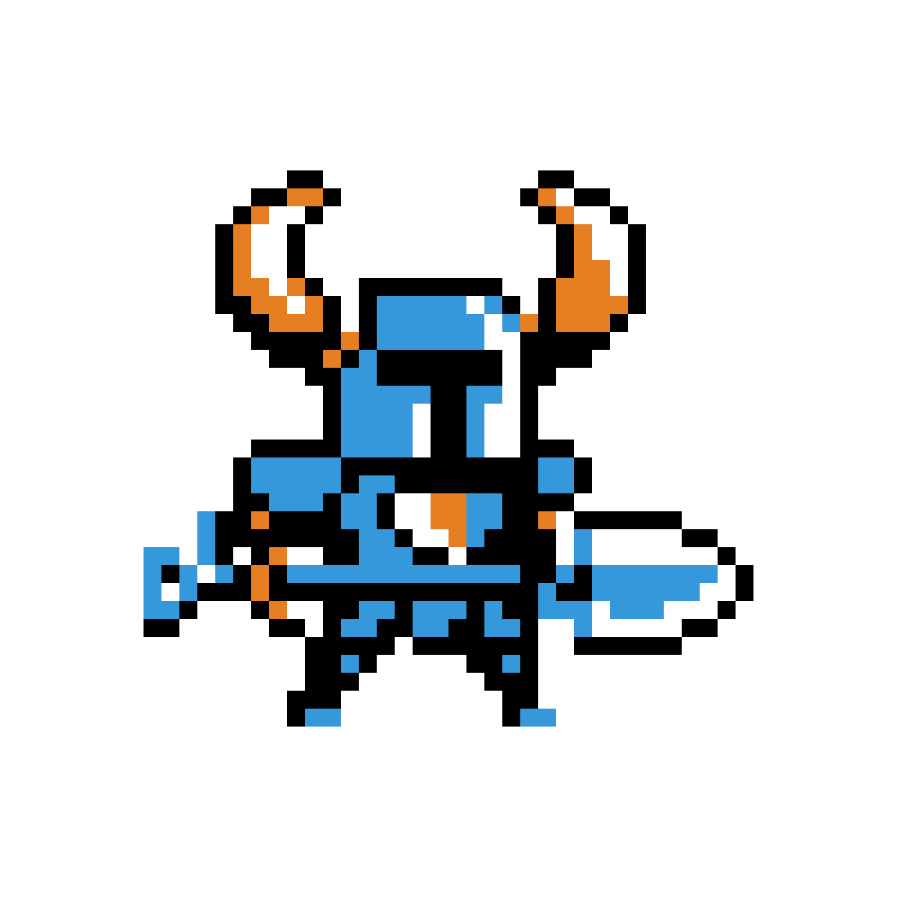

# 1.4a Features of Proposed Solution

## Player

### Movement

#### 8 Directional Movement

The player will have 8 directional movement (similar to [Soul Knight](1.3-research-the-problem.md#soul-knight), [Moonlighter](1.3-research-the-problem.md#moonlighter), and [Enter the Gungeon](1.3-research-the-problem.md#enter-the-gungeon)) which will be controlled using the WASD keys.


Holding \[W] will cause the player to move up ↑

Holding \[A] will cause the player to move left ←

Holding \[S] will cause the player to move right →

Holding \[D] will cause the player to move down ↓


A combination of these inputs will allow diagonal movement (e.g. W and S will cause the player to move up and to the right ↗) hence 8 directional movement.

#### Rolling

<figure><figcaption>
<a href="https://enterthegungeon.fandom.com/wiki/Dodge_Roll_(Move)">https://enterthegungeon.fandom.com/wiki/Dodge_Roll_(Move)</a>
</figcaption></figure>

In both [Moonlighter](1.3-research-the-problem.md#moonlighter) and [Enter the Gungeon](1.3-research-the-problem.md#enter-the-gungeon) the roll mechanic is vital for dodging attacks as well as movement around the dungeons. The roll will grant the player increased velocity in their current direction as well as invincibility for a short period of time. The roll will be activated using \[Space].

### Character

#### Sprite Inspiration

<table data-view="cards"><thead><tr><th></th><th></th><th></th></tr></thead><tbody><tr><td></td><td></td><td><a href="https://steamcommunity.com/sharedfiles/filedetails/?id=2114943348">https://steamcommunity.com/sharedfiles/filedetails/?id=2114943348</a>  I like the simplicity of the Gungeoneers' designs in <a href="1.3-research-the-problem.md#enter-the-gungeon">Enter the Gungeon</a>.</td></tr><tr><td></td><td><a href="https://www.cleanpng.com/png-shovel-knight-plague-of-shadows-sprite-yacht-club-6240850/">https://www.cleanpng.com/png-shovel-knight-plague-of-shadows-sprite-yacht-club-6240850/</a>  I like how Shovel Knight is designed with the "T" shaped hole in his helmet being completely colored black.</td><td></td></tr><tr><td></td><td> </td><td> <a href="https://soul-knight.fandom.com/es/wiki/Caballero">https://soul-knight.fandom.com/es/wiki/Caballero</a>  I like how the Knight character from <a href="1.3-research-the-problem.md#soul-knight">Soul Knight</a> is textured and colored.</td></tr></tbody></table>

#### Animation

<figure><figcaption></figcaption></figure>

##

## Broad Category 1

### Specific Feature 1

Description of some specific feature you wish to build

## Limitations

### Limitation 1

Description of a limitation, due to scope/time constraints or difficulty of implementation.
