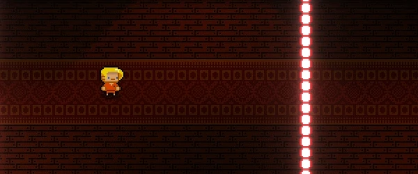
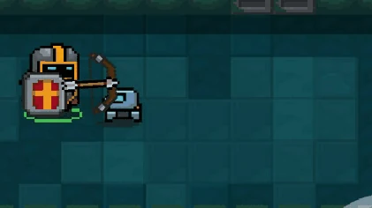
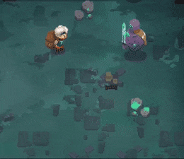

# 1.4a Features of Proposed Solution

##

## Player

### Movement

#### 8 Directional Movement

The player will have 8 directional movement (similar to [Soul Knight](1.3-research-the-problem.md#soul-knight), [Moonlighter](1.3-research-the-problem.md#moonlighter), and [Enter the Gungeon](1.3-research-the-problem.md#enter-the-gungeon)) which will be controlled using the WASD keys.


Holding \[W] will cause the player to move up ↑

Holding \[A] will cause the player to move left ←

Holding \[S] will cause the player to move right →

Holding \[D] will cause the player to move down ↓


A combination of these inputs will allow diagonal movement (e.g. W and S will cause the player to move up and to the right ↗) hence 8 directional movement.

#### Rolling

<figure><figcaption>
<a href="https://enterthegungeon.fandom.com/wiki/Dodge_Roll_(Move)">https://enterthegungeon.fandom.com/wiki/Dodge_Roll_(Move)</a>
</figcaption></figure>

In both [Moonlighter](1.3-research-the-problem.md#moonlighter) and [Enter the Gungeon](1.3-research-the-problem.md#enter-the-gungeon) the roll mechanic is vital for dodging attacks as well as movement around the dungeons. The roll will grant the player increased velocity in their current direction as well as invincibility for a short period of time.

### Character

#### Sprite Inspiration

<table data-view="cards"><thead><tr><th></th><th></th><th data-hidden data-card-cover data-type="files"></th></tr></thead><tbody><tr><td><a href="https://steamcommunity.com/sharedfiles/filedetails/?id=2114943348">https://steamcommunity.com/sharedfiles/filedetails/?id=2114943348</a></td><td>I like the simplicity of the Gungeoneers' designs in <a href="1.3-research-the-problem.md#enter-the-gungeon">Enter the Gungeon</a>.</td><td><a href="../.gitbook/assets/image (2) (6).png">image (2) (6).png</a></td></tr><tr><td><a href="https://www.pngkit.com/view/u2w7r5e6e6w7y3y3_shovel-knight-shovel-knight-pixel-sprite/">https://www.pngkit.com/view/u2w7r5e6e6w7y3y3_shovel-knight-shovel-knight-pixel-sprite/</a></td><td>I like how Shovel Knight's helmet is designed. I particularly like the "T" being colored black. </td><td><a href="../.gitbook/assets/image (3) (2) (1).png">image (3) (2) (1).png</a></td></tr><tr><td> <a href="https://soul-knight.fandom.com/es/wiki/Caballero">https://soul-knight.fandom.com/es/wiki/Caballero</a></td><td>I like how the Knight character from <a href="1.3-research-the-problem.md#soul-knight">Soul Knight</a> is textured and colored.</td><td><a href="../.gitbook/assets/image (11) (1).png">image (11) (1).png</a></td></tr></tbody></table>

My character will be a mixture of all three of these designs and I have name him "Bucket Knight".

<figure><figcaption></figcaption></figure>

#### Animation

<figure><figcaption>
<a href="https://www.spriters-resource.com/pc_computer/enterthegungeon/sheet/155740/">https://www.spriters-resource.com/pc_computer/enterthegungeon/sheet/155740/</a>
</figcaption></figure>

I like [Enter the Gungeon](1.3-research-the-problem.md#enter-the-gungeon)'s bouncy animations (as shown in the spritesheet above) as it gives the game a good amount of character. This combined with [Soul Knight](1.3-research-the-problem.md#soul-knight)'s paper cut-out animation style would make for a great, unique animation style.

## Weapons

Weapons will fall under 1 of 3 classes: Melee, Ranger, and Mage.

### Melee

<figure><figcaption>
<a href="https://www.jbinthelede.com/blog/2018/6/4/moonlight-review-shopkeeper-in-the-streets-hero-in-the-deeps">https://www.jbinthelede.com/blog/2018/6/4/moonlight-review-shopkeeper-in-the-streets-hero-in-the-deeps</a>
</figcaption></figure>

Melee weapons will require close quarter combat and will have above average damage output in expense for putting yourself in danger. Examples of melee weapons include: daggers, spears, short-swords, broad-swords, and axes. These weapons won't require as much aiming.

### Ranger

<figure><figcaption>
<a href="https://soul-knight.fandom.com/wiki/Bow">https://soul-knight.fandom.com/wiki/Bow</a>
</figcaption></figure>

Ranger weapons will require charge-up time before use and require aim. However, ranger weapons will have high damage output per shot. Examples of ranger weapons include: longbows, crossbows, and compound bows.

### Mage

<figure><figcaption>
<a href="https://www.youtube.com/watch?app=desktop&#x26;v=4UGCxX_Dluo">https://www.youtube.com/watch?app=desktop&#x26;v=4UGCxX_Dluo</a>
</figcaption></figure>

Mage class weapons will have high projectile output and wide spread with a low amount of damage per bullet. Examples of mage class weapons include: staffs, wands, and sceptres.


Mage class weapons are substitutes for the usual gun weapons (such as shotguns and pistols). This is because the [story ](1.4a-features-of-the-proposed-solution.md#story)for the game wouldn't align with the use of firearms due to the setting the story has been placed in.


## Enemies

As I plan to have 3 classes of weapons, there will be 3 classes of enemies as well as a boss.

### Melee Class Enemies

<figure><figcaption>
<a href="https://gfycat.com/@unbuliebubble/collections/586884c5b45bbb2a201f5dff649e17c7/game_-_moonlighter">https://gfycat.com/@unbuliebubble/collections/586884c5b45bbb2a201f5dff649e17c7/game_-_moonlighter</a>
</figcaption></figure>

Melee class enemies have high health and try to get close to the player to deal a heavy blow using their melee weapon. They protect other, lower health enemies (hence the high stats) but are usually easy to evade.

### Ranger Class Enemies

<figure><figcaption>
<a href="https://soul-knight.fandom.com/wiki/Enemies">https://soul-knight.fandom.com/wiki/Enemies</a>
</figcaption></figure>

Ranger class enemies will be inspired by [Soul Knight](1.3-research-the-problem.md#soul-knight)'s enemy bow users (as seen above). Enemies with a bow will require some charge-up time before they fire at the player. These characters will have high damage output but low health which will encourage the player to close in on them with a melee weapon which may put them at risk from other attackers (such as [Melee Class Enemies](1.4a-features-of-the-proposed-solution.md#melee-class-enemies)).

### Mage Class Enemies

These enemies will provide constant pressure towards the player due to their high projectile output.

<figure><figcaption>
<a href="https://memeburn.com/gearburn/2017/02/soul-knight-and-narcissus-this-weeks-top-mobile-games/">https://memeburn.com/gearburn/2017/02/soul-knight-and-narcissus-this-weeks-top-mobile-games/</a>
</figcaption></figure>

These enemies will act similarly to the enemies in [Soul Knight](1.3-research-the-problem.md#soul-knight) and [Enter the Gungeon](1.3-research-the-problem.md#enter-the-gungeon) that use guns as they will constantly shoot at the player whenever they can. I have replaced the guns, however, with magic staffs as it fits the loose Medieval setting I am going for in the game's [story](1.4a-features-of-the-proposed-solution.md#my-story) even though they share similar functionality. These enemies will have a moderate amount of health and low damage output per bullet.

## Boss

The boss class will be the toughest class to defeat due to bosses having high health, high damage output, and high projectile output.

<figure><figcaption>
<a href="https://www.kickstarter.com/projects/digitalsun/moonlighter/description?lang=de">https://www.kickstarter.com/projects/digitalsun/moonlighter/description?lang=de</a>
</figcaption></figure>

However, a weakess of the boss should be movement. To make it easier for the player to defeat the boss, the boss shouldn't move so the player doesn't have to multitask movement and aiming. This is inspired by the Golem King from [Moonlighter](1.3-research-the-problem.md#moonlighter).

## Progression

## Procedural Generation

## Controls

<figure><figcaption>
The controls for my game
</figcaption></figure>

### Keyboard Controls

As previously mentioned, the WASD keys will allow for movement but, on top of that, they will also be responsible for menu navigation (such as the start menu and the pause menu).

&#x20;Other controls include:


\[E] to interact with objects (such as chests and weapons).

\[P] to open the pause menu.

\[SPACE] to activate the [roll](1.4a-features-of-the-proposed-solution.md#rolling) ability.

\[SPACE] while in a menu to interact with the menu.

\[SHIFT] to switch weapons.


### Mouse Controls

The mouse will be used to aim the player's weapons at the enemy. The mouse position will be where the player is shooting.

<table data-view="cards"><thead><tr><th></th><th></th><th data-hidden data-card-cover data-type="files"></th></tr></thead><tbody><tr><td><a href="https://www.shutterstock.com/image-vector/mouse-buttons-vector-illustration-demonstration-left-301091408">https://www.shutterstock.com/image-vector/mouse-buttons-vector-illustration-demonstration-left-301091408</a></td><td>The [LEFT_MOUSE_BUTTON] will be used to fire the weapon. This can be held down for all weapons so they can be auto-fired.</td><td><a href="../.gitbook/assets/image (6) (4).png">image (6) (4).png</a></td></tr><tr><td><a href="https://www.shutterstock.com/image-vector/mouse-buttons-vector-illustration-demonstration-left-301091408">https://www.shutterstock.com/image-vector/mouse-buttons-vector-illustration-demonstration-left-301091408</a></td><td>The [RIGHT_MOUSE_BUTTON] will also be used to <a href="1.4a-features-of-the-proposed-solution.md#rolling">roll</a>. However, this <a href="1.4a-features-of-the-proposed-solution.md#rolling">roll</a> will be in the direction of the mouse making it </td><td><a href="../.gitbook/assets/image (12) (2).png">image (12) (2).png</a></td></tr><tr><td><a href="https://uxwing.com/mouse-scroll-wheel-icon/">https://uxwing.com/mouse-scroll-wheel-icon/</a></td><td>The [SCROLL_WHEEL] will be used to switch between the player's two weapons.</td><td><a href="../.gitbook/assets/image (14).png">image (14).png</a></td></tr></tbody></table>

## Story

A common video game trope is "Save the Princess"([https://tropedia.fandom.com/wiki/Save\_the\_Princess](https://tropedia.fandom.com/wiki/Save\_the\_Princess)) as it provides a simple goal for the player to achieve and gives them a sense of fulfillment as well.

### Examples of Games that "Save the Princess"

<table data-view="cards"><thead><tr><th></th><th></th><th data-hidden data-card-cover data-type="files"></th></tr></thead><tbody><tr><td><a href="https://www.youtube.com/watch?v=90x2-E3DdxY">https://www.youtube.com/watch?v=90x2-E3DdxY</a>  In NEW Super Mario Brothers Wii the main goal of the game is to save Princess Peach from Bowser's Castle.</td><td></td><td><a href="../.gitbook/assets/image (12) (1).png">image (12) (1).png</a></td></tr><tr><td><a href="https://avidachievers.com/speedruns/jump-king-speedrun-guide/">https://avidachievers.com/speedruns/jump-king-speedrun-guide/</a></td><td>In Jump King the goal of the game is to reach the top of the tower to reach the "Smoking Hot Babe".</td><td><a href="../.gitbook/assets/image (6) (2).png">image (6) (2).png</a></td></tr><tr><td><a href="https://www.youtube.com/watch?v=VsIpIVm1xKk">https://www.youtube.com/watch?v=VsIpIVm1xKk</a></td><td>In Legend of Zelda: Breath of the Wild Link has to save Princess Zelda and defeat the Calamity in order to save Hyrule.</td><td><a href="../.gitbook/assets/image (10).png">image (10).png</a></td></tr></tbody></table>

### My Story

In my game, placed in a loose Medieval setting, you will be playing a character named "Bucket Knight" where your goal is to "Save the Princess" from the evil forces acting in the dungeon. The knight will travel through the dungeon, picking up weapons along the way, and fight enemies to save her.
