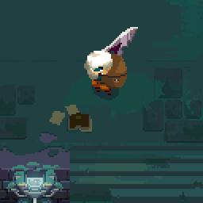
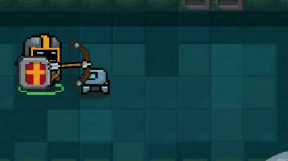
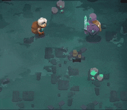
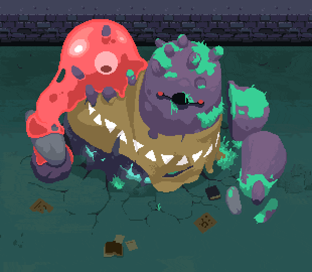

# 1.4a Features of Proposed Solution

## Player

### Movement

#### 8 Directional Movement

The player will have 8 directional movements (similar to [Soul Knight](research-the-problem.md#soul-knight), [Moonlighter](research-the-problem.md#moonlighter), and [Enter the Gungeon](research-the-problem.md#enter-the-gungeon)) which will be controlled using the WASD keys.


Holding \[W] will cause the player to move up ↑

Holding \[A] will cause the player to move left ←

Holding \[S] will cause the player to move right →

Holding \[D] will cause the player to move down ↓


A combination of these inputs will allow diagonal movement (e.g. W and D will cause the player to move up and to the right ↗) hence 8 directional movements.

#### Rolling

<figure><figcaption>
<a href="https://enterthegungeon.fandom.com/wiki/Dodge_Roll_(Move)">https://enterthegungeon.fandom.com/wiki/Dodge_Roll_(Move)</a>
</figcaption></figure>

In both [Moonlighter](research-the-problem.md#moonlighter) and [Enter the Gungeon](research-the-problem.md#enter-the-gungeon) the roll mechanic is vital for dodging attacks as well as movement around the dungeons. The roll ability will grant the player increased velocity in their current direction as well as invincibility for a short period of time.

The roll ability will have a short cool-down so the player can't keep constantly rolling around the place dodging attacks.

### Camera

The game will have a top-down camera system (like [Soul Knight](research-the-problem.md#soul-knight), [Moonlighter](research-the-problem.md#moonlighter), and [Enter the Gungeon](research-the-problem.md#enter-the-gungeon)) which follows the player so the player can see where they are currently going and what they are doing.

The camera will be an orthographic camera, which is a camera that renders everything to the same scale ([Prusa, 2021](references.md#camera)), which is ideal for 2D games as everything needs to look the same distance away.

<figure><figcaption>
A picture depicting the differences between a perspective camer and an orthagraphic camera (<a href="references.md#camera">Prusa, 2021</a>)
</figcaption></figure>

### Character

#### Sprite Inspiration

<table data-view="cards"><thead><tr><th></th><th></th><th data-hidden data-card-cover data-type="files"></th></tr></thead><tbody><tr><td><a href="https://steamcommunity.com/sharedfiles/filedetails/?id=2114943348">https://steamcommunity.com/sharedfiles/filedetails/?id=2114943348</a></td><td>I like the simplicity of the Gungeoneers' designs in <a href="research-the-problem.md#enter-the-gungeon">Enter the Gungeon</a>.</td><td><a href="../.gitbook/assets/image (5) (2) (1).png">image (5) (2) (1).png</a></td></tr><tr><td><a href="https://www.pngkit.com/view/u2w7r5e6e6w7y3y3_shovel-knight-shovel-knight-pixel-sprite/">https://www.pngkit.com/view/u2w7r5e6e6w7y3y3_shovel-knight-shovel-knight-pixel-sprite/</a></td><td>I like how Shovel Knight's helmet is designed. I particularly like the "T" being colored black. </td><td><a href="../.gitbook/assets/image (3) (2) (1).png">image (3) (2) (1).png</a></td></tr><tr><td> <a href="https://soul-knight.fandom.com/es/wiki/Caballero">https://soul-knight.fandom.com/es/wiki/Caballero</a></td><td>I like how the Knight character from <a href="research-the-problem.md#soul-knight">Soul Knight</a> is textured and colored.</td><td><a href="../.gitbook/assets/image (11) (1).png">image (11) (1).png</a></td></tr></tbody></table>

My character will be a mixture of all three of these designs with the pixel art style. I have named him "Bucket Knight".

<figure><figcaption>
A early rendition of "Bucket Knight"
</figcaption></figure>

#### Animation

<figure><figcaption>
<a href="https://www.spriters-resource.com/pc_computer/enterthegungeon/sheet/155740/">https://www.spriters-resource.com/pc_computer/enterthegungeon/sheet/155740/</a>
</figcaption></figure>

I like to [Enter the Gungeon](research-the-problem.md#enter-the-gungeon)'s bouncy animations (as shown in the sprite sheet above) as it gives the game a good amount of character. This combined with [Soul Knight](research-the-problem.md#soul-knight)'s paper cut-out animation style would make for a great, unique animation style.

## HP and Damage

Both players and enemies will have a set number of hit-points (HP) which will decrease by a variable amount depending on how much damage the entity receives which will depend on the weapon used against them.

The more damage the weapon does results in more HP being depleted and, when HP goes below or is equal to 0, the entity will be destroyed. If this entity is the player, the game will end and display a game on the screen.

<figure><figcaption>
Healthbar from <a href="research-the-problem.md#moonlighter">Moonlighter</a> (<a href="https://moonlighterthegame.com/console_date_reveal/">https://moonlighterthegame.com/console_date_reveal/</a>)
</figcaption></figure>

This system is used in all three previously mentioned games ([Soul Knight](research-the-problem.md#soul-knight), [Moonlighter](research-the-problem.md#moonlighter), and [Enter the Gungeon](research-the-problem.md#enter-the-gungeon))

## Weapons

The player will pick up weapons they find along the way in [chests](features-of-the-proposed-solution.md#progression). Weapons will fall under 1 of 3 classes: [Melee](features-of-the-proposed-solution.md#melee), [Ranger](features-of-the-proposed-solution.md#ranger), and [Mage](features-of-the-proposed-solution.md#mage). This will give the game some variety which makes players play for longer ([https://www.gamedeveloper.com/design/the-importance-of-variety-in-gaming](https://www.gamedeveloper.com/design/the-importance-of-variety-in-gaming)).

### Types

Each weapon will have a good and bad weapon match-up similar to the types in Pokémon.

<figure><figcaption>
<a href="http://ffden-2.phys.uaf.edu/webproj/211_fall_2016/Sabina_Kryshak-Karwowski/sabina_kryshakkarwowski/Slide8_Pokedex.html">http://ffden-2.phys.uaf.edu/webproj/211_fall_2016/Sabina_Kryshak-Karwowski/sabina_kryshakkarwowski/Slide8_Pokedex.html</a>
</figcaption></figure>


For my game:

Melee -> Ranger -> Mage -> Melee -> ...


A good match-up will result in more damage against the opposing enemy (e.g. Melee vs Ranger Enemy) and a bad match-up will result in less damage against the opposing enemy (e.g. Melee vs Mage Enemy).

This will add a little more strategy to the game as you only can carry two of the three weapon types at a time.

### Melee

<figure><figcaption>
<a href="https://www.jbinthelede.com/blog/2018/6/4/moonlight-review-shopkeeper-in-the-streets-hero-in-the-deeps">https://www.jbinthelede.com/blog/2018/6/4/moonlight-review-shopkeeper-in-the-streets-hero-in-the-deeps</a>
</figcaption></figure>

Melee weapons will require close-quarter combat and will have above-average damage output at the expense of putting yourself in danger. Examples of melee weapons include daggers, spears, short-swords, broad-swords, and axes. These weapons won't require as much aiming.

### Ranger

<figure><figcaption>
<a href="https://soul-knight.fandom.com/wiki/Bow">https://soul-knight.fandom.com/wiki/Bow</a>
</figcaption></figure>

Ranger weapons will require charge-up time before use and require aim. However, ranger weapons will have high damage output per shot. Examples of ranger weapons include longbows, crossbows, and compound bows.

### Mage

<figure><figcaption>
<a href="https://www.youtube.com/watch?app=desktop&#x26;v=4UGCxX_Dluo">https://www.youtube.com/watch?app=desktop&#x26;v=4UGCxX_Dluo</a>
</figcaption></figure>

Mage-class weapons will have high projectile output and be widespread with a low amount of damage per bullet. Examples of mage-class weapons include staffs, wands, and sceptres.


Mage-class weapons are substitutes for the usual gun weapons (such as shotguns and pistols). This is because the [story ](features-of-the-proposed-solution.md#story)for the game wouldn't align with the use of firearms due to the setting the story has been placed in.


## Enemies

As I plan to have 3 classes of weapons, there will be 3 classes of enemies as well as a boss.

Each enemy will have basic enemy AI unique to their respective class. For example, [Melee Enemies](features-of-the-proposed-solution.md#melee-class-enemies) will path-find and move straight towards the player but the more ranged classes' enemies will keep their distance from the player but still try to get a clear line of sight in order to damage the player.

This will give the game more variety, like the weapons, which will allow the game to keep a player's attention ([https://www.gamedeveloper.com/design/the-importance-of-variety-in-gaming](https://www.gamedeveloper.com/design/the-importance-of-variety-in-gaming)). This will also add more depth to the challenge the game provides as there are more obstacles to overcome.

### Melee Class Enemies

<figure><figcaption>
<a href="https://gfycat.com/@unbuliebubble/collections/586884c5b45bbb2a201f5dff649e17c7/game_-_moonlighter">https://gfycat.com/@unbuliebubble/collections/586884c5b45bbb2a201f5dff649e17c7/game_-_moonlighter</a>
</figcaption></figure>

Melee class enemies have high health and try to get close to the player to deal a heavy blow using their melee weapon. They protect other, lower health enemies (hence the high stats) but are usually easy to evade.

### Ranger Class Enemies

<figure><figcaption>
<a href="https://soul-knight.fandom.com/wiki/Enemies">https://soul-knight.fandom.com/wiki/Enemies</a>
</figcaption></figure>

Ranger-class enemies will be inspired by [Soul Knight](research-the-problem.md#soul-knight)'s enemy bow users (as seen above). Enemies with a bow will require some charge-up time before they fire at the player. These characters will have high damage output but low health which will encourage the player to close in on them with a melee weapon which may put them at risk from other attackers (such as [Melee Class Enemies](features-of-the-proposed-solution.md#melee-class-enemies)).

### Mage Class Enemies

These enemies will provide constant pressure towards the player due to their high projectile output.

<figure><figcaption>
<a href="https://memeburn.com/gearburn/2017/02/soul-knight-and-narcissus-this-weeks-top-mobile-games/">https://memeburn.com/gearburn/2017/02/soul-knight-and-narcissus-this-weeks-top-mobile-games/</a>
</figcaption></figure>

These enemies will act similarly to the enemies in [Soul Knight](research-the-problem.md#soul-knight) and [Enter the Gungeon](research-the-problem.md#enter-the-gungeon) that use guns as they will constantly shoot at the player whenever they can. I have replaced the guns, however, with magic staffs as it fits the loose Medieval setting I am going for in the game's [story](features-of-the-proposed-solution.md#my-story) even though they share similar functionality. These enemies will have a moderate amount of health and low damage output per bullet.

### Boss

The boss class will be the toughest class to defeat due to bosses having high health, high damage output, and high projectile output.

<figure><figcaption>
<a href="https://www.kickstarter.com/projects/digitalsun/moonlighter/description?lang=de">https://www.kickstarter.com/projects/digitalsun/moonlighter/description?lang=de</a>
</figcaption></figure>

However, a weakness of the boss should be movement. To make it easier for the player to defeat the boss, the boss shouldn't move so the player doesn't have to multitask movement and aiming. This is inspired by the Golem King from [Moonlighter](research-the-problem.md#moonlighter).

There will be 3 mini bosses and a final boss which will appear at the end of their respective levels.

## Progression

In every room, there will be a small chance to contain a chest (similar to [Moonlighter](research-the-problem.md#moonlighter)).

<figure><figcaption>
Chest from <a href="research-the-problem.md#soul-knight">Soul Knight</a> <a href="https://soul-knight.fandom.com/wiki/Chests">https://soul-knight.fandom.com/wiki/Chests</a>
</figcaption></figure>

In these chests, there will be either a new weapon or a health pickup so the player can keep on going for longer.

As the player travels deeper into the dungeon their weapons will become worse compared to the level of the enemies (enemies grow stronger after each level). I have solved this problem by adding weapon rarities. This means that the weapons will have the same function but so more damage per projectile.

> <mark style="color:yellow;">Legendary</mark> - Adds +3 damage and even faster firing speed
>
> <mark style="color:purple;">Epic -</mark> Adds +2 damage and faster firing speed
>
> <mark style="color:blue;">Rare</mark> - Adds +2 damage
>
> <mark style="color:green;">Uncommon</mark> - Adds +1 damage
>
> Common - Uses base damage and firing speed

Each weapon can be legendary or common etc depending on the player's luck (which will increase every level).

The colouring system of these rarities is similar to Fortnite ([https://fortnite.fandom.com/wiki/Rarity](https://fortnite.fandom.com/wiki/Rarity)) and other games which will help the player realize which weapon is better (the weapon name text will be coloured to match its rarity).&#x20;

These rarities will also apply to enemies allowing enemies to grow in strength as the character gets stronger allowing for later levels to be more challenging than the previous ones. However, enemy rarities will buff the enemies' stats as a whole rather than just their weapons.

## Procedural Generation

To procedurally generate dungeon layouts I will use a 4x4 grid. The start room will always generate in the top left corner \[0, 0] and will generate 6 - 8 rooms before generating the end room.

The player can leave the level (and move on to the next) by interacting with a staircase in the end room unless the player is on the last level (which will spawn the boss room instead). If this room didn't spawn then the player couldn't progress so this is vital to progression.

<figure><figcaption>
An example how room generation may work (the green represents the start room, the red represents the journey the player must make going through the rooms, and the purple represents the end room).
</figcaption></figure>

Each room will also have a 20% chance to spawn a chest which will be accessible after defeating all enemies in a room.&#x20;

Each room will be pre-built in a similar style to [Moonlighter](research-the-problem.md#moonlighter)'s dungeon rooms and will have randomly generated enemy spawn points in order to add some randomness into the mix. These rooms will be of a uniform size (12 x 12 tiles) and will have an exit and entry point on each of the 4 sides which can be toggled on/off The rooms will not have pits though (unlike [Moonlighter](research-the-problem.md#moonlighter)'s rooms).

## Controls

<figure><figcaption>
The controls for my game
</figcaption></figure>

### Keyboard Controls

As previously mentioned, the WASD keys will allow for movement but, on top of that, they will also be responsible for menu navigation (such as the start menu and the pause menu).

&#x20;Other controls include:


\[E] to interact with objects (such as chests and weapons).

\[P] to open the pause menu.

\[SPACE] to activate the [roll](features-of-the-proposed-solution.md#rolling) ability.

\[SPACE] while in a menu to interact with the menu.

\[SHIFT] to switch weapons.


### Mouse Controls

The mouse will be used to aim the player's weapons at the enemy. The mouse position will be where the player is shooting.

<table data-view="cards"><thead><tr><th></th><th></th><th data-hidden data-card-cover data-type="files"></th></tr></thead><tbody><tr><td><a href="https://www.shutterstock.com/image-vector/mouse-buttons-vector-illustration-demonstration-left-301091408">https://www.shutterstock.com/image-vector/mouse-buttons-vector-illustration-demonstration-left-301091408</a></td><td>The [LEFT_MOUSE_BUTTON] will be used to fire the weapon. This can be held down for all weapons so they can be auto-fired.</td><td><a href="../.gitbook/assets/image (6) (4).png">image (6) (4).png</a></td></tr><tr><td><a href="https://www.shutterstock.com/image-vector/mouse-buttons-vector-illustration-demonstration-left-301091408">https://www.shutterstock.com/image-vector/mouse-buttons-vector-illustration-demonstration-left-301091408</a></td><td>The [RIGHT_MOUSE_BUTTON] will also be used to <a href="features-of-the-proposed-solution.md#rolling">roll</a>. However, this <a href="features-of-the-proposed-solution.md#rolling">roll</a> will be in the direction of the mouse making it </td><td><a href="../.gitbook/assets/image (12) (2).png">image (12) (2).png</a></td></tr><tr><td><a href="https://uxwing.com/mouse-scroll-wheel-icon/">https://uxwing.com/mouse-scroll-wheel-icon/</a></td><td>The [SCROLL_WHEEL] will be used to switch between the player's two weapons.</td><td><a href="../.gitbook/assets/image (14).png">image (14).png</a></td></tr></tbody></table>

## Story

A common video game trope is "Save the Princess"([https://tropedia.fandom.com/wiki/Save\_the\_Princess](https://tropedia.fandom.com/wiki/Save\_the\_Princess)) as it provides a simple goal for the player to achieve and gives them a sense of fulfilment as well.

### Examples of Games that "Save the Princess"

<table data-view="cards"><thead><tr><th></th><th></th><th data-hidden data-card-cover data-type="files"></th></tr></thead><tbody><tr><td><a href="https://www.youtube.com/watch?v=90x2-E3DdxY">https://www.youtube.com/watch?v=90x2-E3DdxY</a>  In NEW Super Mario Brothers Wii the main goal of the game is to save Princess Peach from Bowser's Castle.</td><td></td><td><a href="../.gitbook/assets/image (12) (1).png">image (12) (1).png</a></td></tr><tr><td><a href="https://avidachievers.com/speedruns/jump-king-speedrun-guide/">https://avidachievers.com/speedruns/jump-king-speedrun-guide/</a></td><td>In Jump King the goal of the game is to reach the top of the tower to reach the "Smoking Hot Babe".</td><td><a href="../.gitbook/assets/image (6) (2) (1) (1).png">image (6) (2) (1) (1).png</a></td></tr><tr><td><a href="https://www.youtube.com/watch?v=VsIpIVm1xKk">https://www.youtube.com/watch?v=VsIpIVm1xKk</a></td><td>In Legend of Zelda: Breath of the Wild Link has to save Princess Zelda and defeat the Calamity in order to save Hyrule.</td><td><a href="../.gitbook/assets/image (10).png">image (10).png</a></td></tr></tbody></table>

### My Story

In my game, placed in a loose Medieval setting, you will be playing a character named "Bucket Knight" whose goal is to "Save the Princess" from the evil forces acting in the dungeon. The knight will travel through the dungeon, picking up weapons along the way, and fight enemies to save her.

## UI and HUD

> "The HUD is what's displayed on the screen while the player is in the game. This shouldn't be confused with the user interface (UI), which can include all the different menus and interactive elements within the game. They often go hand in hand when game design is done well."([https://www.pluralsight.com/blog/film-games/designing-a-hud-that-works-for-your-game](https://www.pluralsight.com/blog/film-games/designing-a-hud-that-works-for-your-game))

### Pause Menu

<figure><figcaption>
<a href="https://soul-knight.fandom.com/wiki/Pause_Menu">https://soul-knight.fandom.com/wiki/Pause_Menu</a>
</figcaption></figure>

In this pause menu mock-up (shown above) there is a "Play Button" (represented by '▶️') which will resume the game, a "How to Play Button" (represented by '❓') which will display an image demonstrating the controls of the game, and a "Quit Button" (represented by '❎') which will exit the current play session and go back the&#x20;

### Main Menu

The Main Menu will just be a larger version of the Pause Menu with a large background image where the ❎ will quit the game. If the player stays on the screen for a while the [story](features-of-the-proposed-solution.md#my-story) of the game will be displayed.

### HUD

The heads-up display will display the player's current health, via a health bar (as seen in [HP and Damage](features-of-the-proposed-solution.md#hp-and-damage)) and the [roll](features-of-the-proposed-solution.md#rolling) cool-down while in the game.

## Collisions

The player, enemies, and projectiles need to collide with the procedural dungeon's walls to prevent the player from going out of bounds or entities never getting destroyed (taking up valuable memory space and processing power). This is similar to [Soul Knight](research-the-problem.md#soul-knight)'s system.

## Limitations

### Multiplayer

Multiplayer is mostly always a good thing to include in games as it provides the user with more enjoyment by playing with a friend.

However, this may prove difficult to implement due to complexities in programming and balancing the game so I have decided to leave this feature out of my project.

### Weapons

Though I have included weapons I do not have the time to program and design more unique weapons in my game so I am not going to include many weapons.

However, I will include rarities for weapons so players feel like there are more weapons than there are.

<figure><figcaption>
<a href="https://www.reddit.com/r/EnterTheGungeon/comments/bstfpn/my_gun_tier_list_template_explanation_in_comments/">https://www.reddit.com/r/EnterTheGungeon/comments/bstfpn/my_gun_tier_list_template_explanation_in_comments/</a>
</figcaption></figure>

### Graphics

I will make graphics for my game but they may be lacking compared to other indie and triple-A developers.

### Event Rooms

Event rooms in [Soul Knight](research-the-problem.md#soul-knight) make the run more interesting. However, due to the scale of my game and the overhaul in how weapons are obtained (compared to [Soul Knight](research-the-problem.md#soul-knight)), I have decided to leave these rooms out as it will take a while to design and program unique rooms and interactions (between NPCs) that also have to fit in the game's [story](features-of-the-proposed-solution.md#my-story).

### Starting Characters

I leaving multiple starting characters out of the game (like [Moonlighter](research-the-problem.md#moonlighter)) as making them unique will prove difficult and may cause changes to the game for all characters to be equal.

### Sounds

As I am not a professional composer or sound effect artist, original sound for my game will be difficult to create. However, I will include sound effects and background music in my game even if it isn't original.

## Other&#x20;

* The game should have a rating of PEGI 7 or less ([Stakeholders](stakeholders.md)).
* Loading times should be reduced as much as possible as long loading times may cause the player to be less invested in the game as they get bored between loads. Also, long loading times between scenes will make the game less seamless between levels.
* The game should run at a consistent frame rate of 60FPS so the game doesn't lag.
* The game shouldn't crash.
* The game should be fun as the main goal of a video game is to provide entertainment ([Corona, 2020](references.md#risk-and-reward-in-computer-games)). `//don't forget to update references//`
* According to the Goldilox Principle ([https://yourdost.com/blog/2016/10/goldilocks-principle.html?q=/blog/2016/10/goldilocks-principle.html&](https://yourdost.com/blog/2016/10/goldilocks-principle.html?q=/blog/2016/10/goldilocks-principle.html&)), the game should be neither too easy nor too hard as this will discourage the player from playing the game again.
