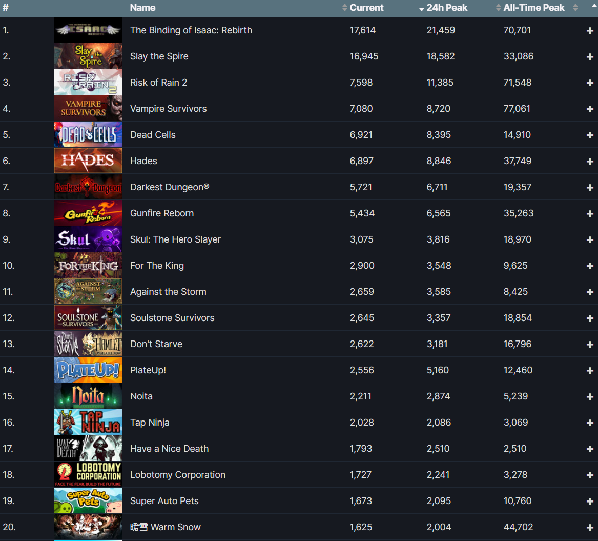

# 2.2.12 Cycle 12

## Design

This cycle was to add features in response to player requests I received from the [Bucket Knight Response Form](https://docs.google.com/forms/d/e/1FAIpQLSewdKSRPxViHy7iZwTl3iMBZkAM8XL76dQIEQXJQ5ZiwxuIdg/viewform). Most requests were to improve the balance of the weapons in the game, but there were some highly requested features I had to implement (such as a game-over screen).

<figure><figcaption><p>Requests for a Game Over screen and a Pause Menu</p></figcaption></figure>

### Objectives

In this cycle, I will:

* [x] Increase attack speed
* [x] Make the melee weapon centred&#x20;
* [x] Buff the melee weapon
* [x] Nerf the magic weapon
* [x] Add a pause menu
* [x] Add a game-over screen
* [x] Create a better movement input system

### Usability Features

Pause Menu - Allowing the player to pause will let them stop playing without losing progress in their current run.

Game Over Screen - This adds a delay between the player dying and the main menu to prevent accidental button presses.

## Development

### Outcome


```cpp
#pragma once

#include "Game.h"
#include "Components.h"

class InputController : public Component
{
public:
    bool w, a, s, d = false; // Flags to track key states

    TransformComponent* transform; // Pointer to the transform component

    void init() override
    {
        // Initialize the pointer to the transform component
        transform = &entity->getComponent<TransformComponent>();
    }

    void update() override
    {
        // Check for key presses and set corresponding flags
        if (Game::event.type == SDL_KEYDOWN)
        {
            switch (Game::event.key.keysym.sym)
            {
            case SDLK_w:
                w = true; // Set 'w' flag to true when 'W' key is pressed
                break;
            case SDLK_s:
                s = true; // Set 's' flag to true when 'S' key is pressed
                break;
            case SDLK_d:
                d = true; // Set 'd' flag to true when 'D' key is pressed
                break;
            case SDLK_a:
                a = true; // Set 'a' flag to true when 'A' key is pressed
                break;
            default:
                break;
            }
        }

        // Check for key releases and reset corresponding flags
        if (Game::event.type == SDL_KEYUP)
        {
            switch (Game::event.key.keysym.sym)
            {
            case SDLK_w:
                w = false; // Reset 'w' flag to false when 'W' key is released
                break;
            case SDLK_s:
                s = false; // Reset 's' flag to false when 'S' key is released
                break;
            case SDLK_d:
                d = false; // Reset 'd' flag to false when 'D' key is released
                break;
            case SDLK_a:
                a = false; // Reset 'a' flag to false when 'A' key is released
                break;
            default:
                break;
            }
        }

        Vector2D dir;

        // Calculate the direction based on the state of 'w', 'a', 's', and 'd' flags
        if (a && d)
        {
            dir.x = 0;
        }
        else if (a)
        {
            dir.x = -1;
        }
        else if (d)
        {
            dir.x = 1;
        }
        else
        {
            dir.x = 0;
        }

        if (w && s)
        {
            dir.y = 0;
        }
        else if (w)
        {
            dir.y = -1;
        }
        else if (s)
        {
            dir.y = 1;
        }
        else
        {
            dir.y = 0;
        }

        // Update the velocity of the transform component based on the calculated direction
        transform->velocity = dir;
    }
};c
```


Although lengthier than my previous solution, this solution should solve issues such as input delay by processing each scenario the user could input.

You can find the rest of the solution [here](https://github.com/Marling-CS-Projects/ODY-ELLIOT-Project/tree/cycles/Bucket%20Knight%20-%20Cycle%2012).

### Challenges

The game-over screen and the pause menu were relatively easy to implement as I have tackled cooldowns and event handling before. It also was easy to change the weapon's stats as it required changing only a couple of variables.&#x20;

To create the pause function I stopped the majority of the `update` function from running. This resulted in bugs, such as the wizard shooting hundreds of times per second, which had to be fixed.

## Testing

<table><thead><tr><th width="90">Test</th><th width="141">Instructions</th><th>What I expect</th><th width="163">What actually happens</th><th>Pass/Fail</th></tr></thead><tbody><tr><td>1</td><td>Press 'P' after the game has started</td><td>The pause menu appears on screen</td><td>As expected</td><td>Pass</td></tr><tr><td>2</td><td>Press buttons</td><td>Something happens</td><td>As expected</td><td>Pass</td></tr></tbody></table>

### Evidence


The video above depicts the twelfth cycle of my game ([https://www.youtube.com/watch?v=XrXzbDvoiRU](https://www.youtube.com/watch?v=XrXzbDvoiRU))


