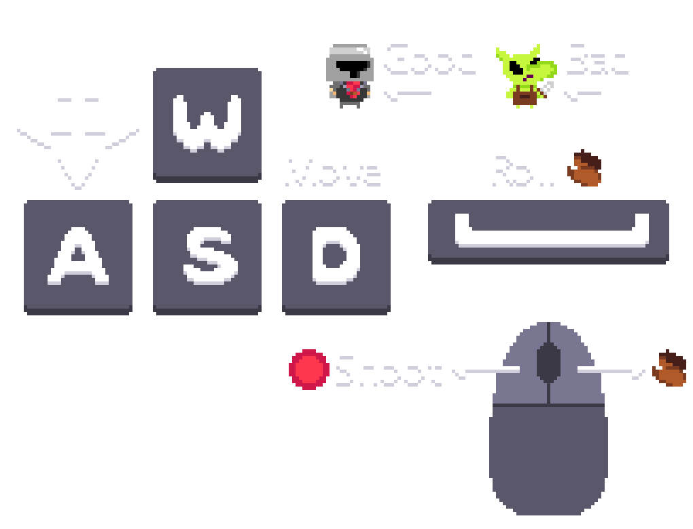

# 2.2.7 Cycle 7

## Design

This cycle is focused on better user experience which I will achieve by adding a How-To-Play screen (shown below) as well as implementing music and sound effects.

<figure><figcaption><p>The How-To-Play Screen Sprite</p></figcaption></figure>


The 'Roll' ability will be added in the next cycle.


### Objectives

In this cycle, I will:

* [x] Import the SDL\_Mixer Library to handle Music and SFX
* [x] Create a How-To-Play button
* [x] Create a How-To-Play Screen
* [x] Add a soundtrack that plays on an infinite loop
* [x] Add sound effects that play in response to an event occurring in the game

### Usability Features

How-To-Play - This feature will allow new players to quickly learn the game's controls allowing them to have a more enjoyable experience.

Volume Levels - More important SFX (sound effects) have a greater volume than others (such as the player being hit being louder than the enemies getting hit) which will alert the user to more significant events taking place above other, less significant events.

### Pseudocode


```cpp
function Game.HowToPlay():
    // Create a back button and add it to the menu group
    backButton = new Trigger(x=24, y=512, width=100, height=27, zIndex=2, image="Assets/Back.png", label="Back Button")
    backButton.entity.addToGroup(menu)

    // Create a how-to-play screen and add it to menu group
    howToPlayScreen = new Trigger(x=0, y=0, width=204, height=156, zIndex=4, image="Assets/HowToPlayScreen.png", label="howtoplay Sprite")
    // The howToPlayScreen has to be a Trigger in order to be added to the menu group
    howToPlayScreen.entity.addToGroup(menu)
```


The `HowToPlay` function is a member of the `Game` class and creates the How-To-Play screen, to display the controls for the game, as well as a 'Back' button to return to the Main Menu when pressed.&#x20;

The How-To-Play button (which triggers the `HowToPlay` function) is created and operated similarly to the `Play` button).

## Development

### Outcome


```cpp
// Initialize the SDL2 Mixer library with MP3 support
Mix_Init(MIX_INIT_MP3);

// Open the audio mixer with the specified settings
Mix_OpenAudio(sampleRate=44100, format=MIX_DEFAULT_FORMAT, channels=2, chunkSize=1024);

// Load the music file
music = Mix_LoadMUS("Assets/Cruising for Goblins.mp3");

// Check if the music loaded successfully
if (music == NULL) {
    // Display an error message and clear any previous error
    Print("Failed to Load Music -> ");
    Print(Mix_GetError());
    Mix_ClearError();
} else {
    // Print a success message
    Print("Loaded 'Cruising for Goblins.mp3' by Kevin MacLeod");
}

// Play the loaded music indefinitely (-1)
Mix_PlayMusic(music, loop=-1);

// Set the music volume
Mix_VolumeMusic(volume=3.5);

// Load sound effect files and set their volumes
shoot = Mix_LoadWAV("Assets/shoot.wav");
shoot.volume = 3;

enemyHit = Mix_LoadWAV("Assets/enemyHit.wav");
enemyHit.volume = 3.5;

playerHit = Mix_LoadWAV("Assets/playerHit.wav");
playerHit.volume = 4.5;

menuClick = Mix_LoadWAV("Assets/menuClick.wav");
menuClick.volume = 3;

newLevel = Mix_LoadWAV("Assets/newLevel.wav");
newLevel.volume = 3;

// Check if any sound effect failed to load and display an error message
if (newLevel == NULL || menuClick == NULL || playerHit == NULL || enemyHit == NULL || shoot == NULL) {
    // Display an error message and clear any previous error
    Print("Failed to Load SFX -> ");
    Print(Mix_GetError());
    Mix_ClearError();
}

```


The music and SFX are loaded in the `init` function (a member of the Game class) so that the files can be used later (such as being played when the player is hit).

This code also prints any errors that occur when loading the sound files to the game's console.

You can find the rest of the solution [here](https://github.com/Marling-CS-Projects/ODY-ELLIOT-Project/tree/cycles/Bucket%20Knight%20-%20Cycle%207).

### Challenges

One challenge of this cycle was the initial import of the SDL\_Mixer library but I had experience with importing the SDL\_Image library so this wasn't a major challenge.

However, there were a few errors and bugs that arose from implementing the music, SFX, and How-To-Play screen which had to be fixed. For example, the How-To-Play screen was part of the menu group but didn't have a collider which caused an error to occur when pressed as there was no collider that could be accessed.

I also made a small tweak as I learned the objects were being updated before moving so each frame presented to the player was actually the previous frame that the game sees.

## Testing

<table><thead><tr><th width="90">Test</th><th width="141">Instructions</th><th>What I expect</th><th width="163">What actually happens</th><th>Pass/Fail</th></tr></thead><tbody><tr><td>1</td><td>Run code</td><td>Music to be playing</td><td>No music played and an error was printed out to the console reading "Failed to Load Music -> Unrecognised File Format"</td><td>Fail</td></tr><tr><td>2</td><td>Run code</td><td>Music to be playing</td><td>As expected</td><td>Pass</td></tr><tr><td>3</td><td>Press the How-To-Play button</td><td>The scene to switch to the How-To-Play screen</td><td>As expected</td><td>Pass</td></tr><tr><td>4</td><td>Press the Back Button </td><td>The scene to revert back to the Main Menu</td><td>As expected</td><td>Pass</td></tr><tr><td>5</td><td>Click the Menu buttons</td><td>The menuClick sound to play</td><td>As expected</td><td>Pass</td></tr><tr><td>6</td><td>Recieve damage from an enemy</td><td>The playerHit sound to play</td><td>As expected</td><td>Pass</td></tr><tr><td>7</td><td>Deal damage to an enemy</td><td>The enemyHit sound to play</td><td>As expected</td><td>Pass</td></tr><tr><td>8</td><td>Destroy all enemies in a level</td><td>The level to change so the newLevel sound plays</td><td>As expected</td><td>Pass</td></tr></tbody></table>

### Testing Evidence

#### Test 1

The music didn't play when the game was started because I hadn't yet allowed the Mixer to take in MP3 files. This was fixed by adding the line `Mix_Init(MIX_INIT_MP3);`.

### Evidence


The video above shows the seventh cycle of my game ([https://youtu.be/rmDgmbXZ\_yc](https://youtu.be/rmDgmbXZ\_yc))


The video has sound and shows that each sound effect is played correctly in response to an event occurring in the game world. I also added credits to the main menu to tell the user who is responsible for each feature the game has.
