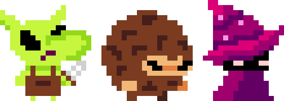

# 2.2.9 Cycle 9

## Design

In this cycle, I will add more enemies to the game as well as add a progression system so each level gets harder and harder.

<figure><figcaption><p>The game's enemy sprites</p></figcaption></figure>

The 'Goblin' enemy was the first enemy added to the game is shown on the left. It will have 3 health points (HP) and will move towards the player in order to deal damage. The 'Wizard' (shown on the right) has 1 HP and will stay still and damage the player via magic projectiles. The 'Furball' (shown in the middle) is a combination of the 'Goblin' and the 'Wizard' and has 2 HP. He moves towards the player slowly and fires projectiles.

### Objectives

In this cycle, I will:

* [x] Create the 'Wizard' enemy
* [x] Create the 'Furball' enemy
* [x] Create a suitable progression system

### Usability Features


### Pseudocode


```cpp
// Loop through a range of values from 0 to (numRooms - 2)
for i from 0 to (numRooms - 2):
    // case if i < 1
    if (i < 1):
        enemyNumber = 1
    elif (i % 2 == 0):
        enemyNumber = i / 2
    else:
        enemyNumber = (i + 1) / 2

    // Ensure that number of enemies does not exceed 10
    if (enemyNumber > 10):
        enemyNumber = 10
```


This code snippet determines the number of enemies each level should have based on their number in the sequence (denoted by `i`).&#x20;

Using the function `f(i) = i / 2` when `i` is even and `f(i) = (i + 1) / 2` when `x` is odd, we can get the sequence of 1, 1, 2, 2, 3, 3, ...

This goes on as `i` increases so I have capped the number of enemies to 10 so the levels don't become impossible.

The first level will always have 1 enemy and the last level will always have 11 enemies as they are initialized separately to the rest of the levels.

## Development

### Outcome

### Challenges

Description of challenges

## Testing

Evidence for testing

### Tests

<table><thead><tr><th width="90">Test</th><th width="141">Instructions</th><th>What I expect</th><th width="163">What actually happens</th><th>Pass/Fail</th></tr></thead><tbody><tr><td>1</td><td>Run code</td><td>Black Re-sizable Window is opened</td><td>As expected</td><td>Pass</td></tr><tr><td>2</td><td>Press buttons</td><td>Something happens</td><td>As expected</td><td>Pass</td></tr></tbody></table>

### Evidence


